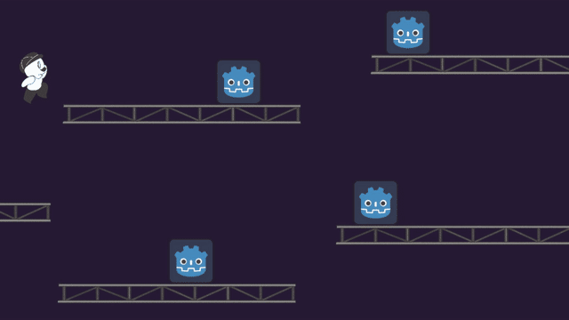

# FoG Game Jam — May 2026

A 2D action platformer made in **Godot 4.6** for the **FoG (May) Game Jam**, built in a few days by a small team.

You play a little guy with a hat on a construction site made of steel beams. You can jump, **hang under beams**, climb between floors and **throw your hat** at enemies. Once you throw it, you have to go pick it back up before you can throw it again.



## Controls

| Action              | Keys                  |
|---------------------|-----------------------|
| Move                | `A` / `D` or `←` / `→` |
| Jump                | `Space`               |
| Climb up a beam (while hanging) | `W` or `↑`  |
| Drop down a beam    | `S` or `↓`            |
| Throw hat           | `F`                   |
| Melee attack        | `E`                   |
| Pause               | `Esc`                 |

## Mechanics

- **Beam traversal**: jumping into a beam from below makes the character hang on it. From there you can climb up to the next floor or let go. On the ground, you can drop through the beam you're standing on.
- **Hat throwing**: the hat is a physics projectile. It spins, bounces off walls (losing speed each time) and comes to rest on the floor. While it's gone, the character uses a set of hatless animations and can't throw again until the hat is picked up or the cooldown runs out.
- **Melee**: a short-range hitbox in front of the player, used for close fights.
- **Enemies**: enemies use a small **finite state machine**. They *patrol* and turn around at walls and ledges (found with a raycast), and switch to *chase* when the player gets close.
- **Combat feel**: hits flash red, there is a brief **hitstop** on impact and the player gets **i-frames** after taking damage.
- **Health/HUD**: a reusable `HealthComponent` is shared by the player and enemies. The HUD shows the player's life as icons.

## Project structure

```
scenes/   Godot scenes (levels, player, enemies, projectiles, UI)
scripts/  GDScript code (player, hat, enemies and their state machine, HUD, pause menu)
sprites/  Hand-drawn art (character, hat, beams, life bar)
```

## Running

1. Install [Godot 4.6](https://godotengine.org/download) (standard build; GDScript only, no .NET needed).
2. Clone the repo:
   ```bash
   git clone https://github.com/briel0/fog-gamejam-maio.git
   ```
3. Open Godot, click **Import**, select `project.godot` and press **F5** to run.

The project uses the **GL Compatibility** renderer, so it should run on most hardware.

## Team

- [Lucas Fernandes Ataide](https://github.com/lucas-ata1de)
- Gabriel ([briel0](https://github.com/briel0))
- [jonatas57](https://github.com/jonatas57)
